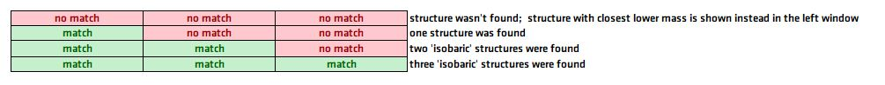
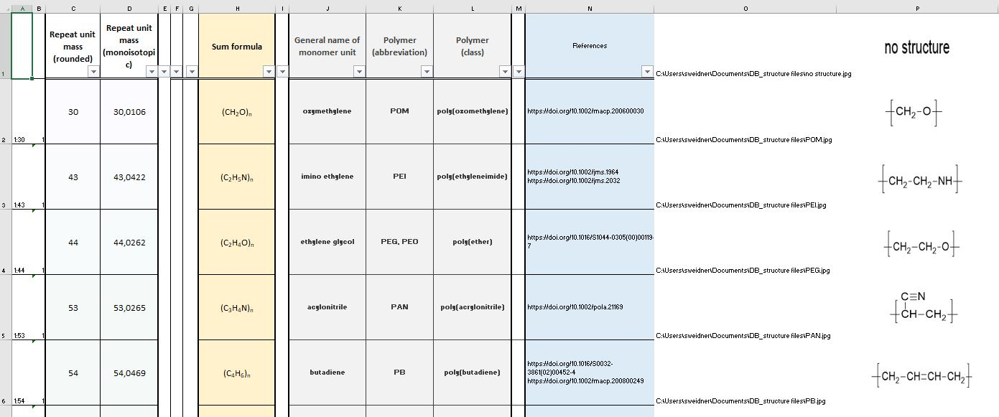

# MALDI Polymer Structure Finder

This project contains a database which classifies polymer structures according to their repeat unit masses, as obtained by MALDI ToF measurements

The MALDI Polymer Structure Finder consist of a simple Excel file that contains 3 sheets

__Mask, Values and Data__

# Mask

This is the search screen.

Here the 'unknown' peak distance can be inserted in the corresponding field (left hand side). Please notice: Since some mass spectrometers do not have sufficient resolution in higher mass ranges, and/or calibration might be slightly wrong ***only*** insert  ***integer numbers***. Any use of  comma or decimal point results in ___no match___.

A short visual explanation is also given underneath the result fields.

In those cases, where no match was found, the __polymer structure with the__ ___closest___ __lower mass number  is displayed in the 1st (left) result field.__

The field #References# contains the URL of available original literature related to the match. This link automatically leads you (depending on the accessibility, see specific rules of your organisation) to the publisher of the literature. In case where more than one reference is displayed, the automatic redirection does not work. Here, the reference links should be _copied/pasted_ one by one in the address line of a web browser.

# Values

The **Values** sheet contains information and variables neccesary to display multiple entries.
For example, mass __58__ can be *polypropylene glycol*, but also *polyglycolide*. Mass __100__ may represent three different polymer structures *PMMA*, *PVL* or *PIBVE*.

# Data

It contains the whole information to run the **Finder**.

   Included are 90 data sets of published polymer structures combining

1.  *rounded (average) repeat unit masses*
2.  *exact monoisotopic masses*
3.  *sum formula*
4.  *general name of monomer units*
5.  *abbreviation of the polymers*
6.  *class of polymers*
7.  *URL of references*
8.  *location (directory) of structure files*
9.  *figures of the structures (jpeg format, drawn in and exported from ChemDraw 18.0)*

The import of structure data and corresponding structure figures requires the use of an (with costs !) Excel add-on called **Image-xls** (agindo GmbH). This must be installed on your computer before.
Typically, every import of new structures starts with adding a name, mass number etc. in a new line at the end of the data base.
Then, a sorting must be performed according to **increasing rounded mass numbers** (without header line).
This is usually followed by drawing the new structure figure, which has to be stored in the *structures* folder. The link to this structure must be filled in the empty cell in column O. Then start **Image-xls**. The new structure will appear in column P.

  In case you add a structure with a mass number that already exist in the table, please check that columns A and B in **Data**  will be updated accordingly. Normally, this should proceed automatically. If not, **Values** will calculate wrong line numbers and wrong structures will be attributed to those masses. One can easily check this in **values**  cells A13/C13/E13.

   ***I'd like to ask everyone to let me know, when new structures were added, or even better, let me do this. This enables a permanent updates of the data base and accessibility of the new data for everyone.***
   
   You can contact me via: steffen.weidner[at]bam.de or create an issue here on GitHub. 
